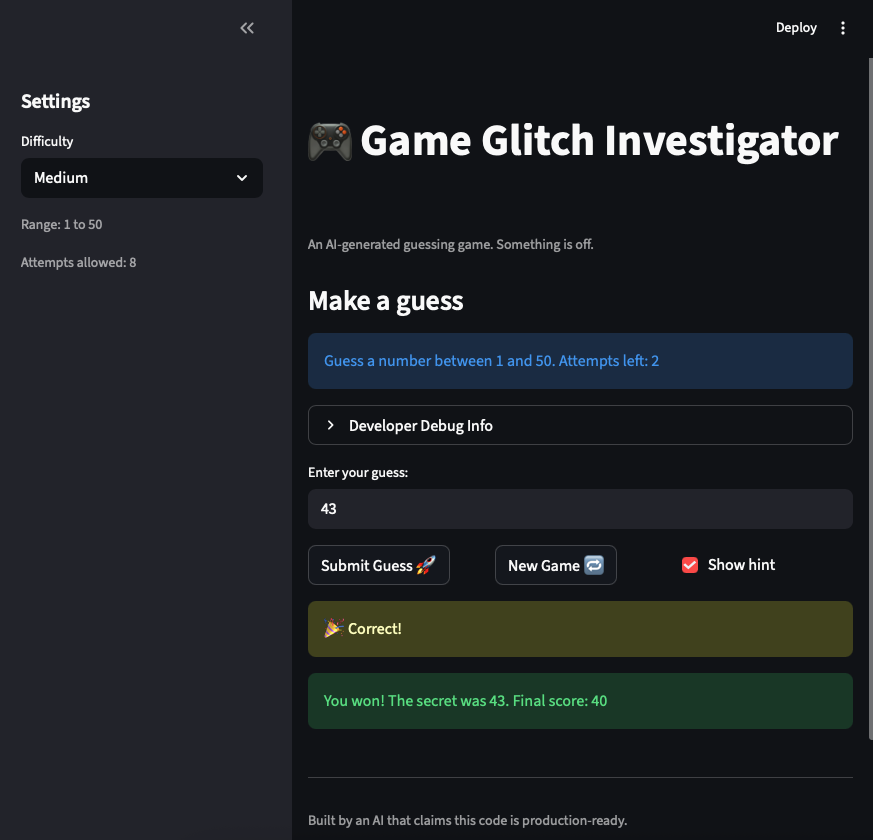

# 🎮 Game Glitch Investigator: The Impossible Guesser

## 🚨 The Situation

You asked an AI to build a simple "Number Guessing Game" using Streamlit.
It wrote the code, ran away, and now the game is unplayable. 

- You can't win.
- The hints lie to you.
- The secret number seems to have commitment issues.

## 🛠️ Setup

1. Install dependencies: `pip install -r requirements.txt`
2. Run the broken app: `python -m streamlit run app.py`

## 🕵️‍♂️ Your Mission

1. **Play the game.** Open the "Developer Debug Info" tab in the app to see the secret number. Try to win.
2. **Find the State Bug.** Why does the secret number change every time you click "Submit"? Ask ChatGPT: *"How do I keep a variable from resetting in Streamlit when I click a button?"*
3. **Fix the Logic.** The hints ("Higher/Lower") are wrong. Fix them.
4. **Refactor & Test.** - Move the logic into `logic_utils.py`.
   - Run `pytest` in your terminal.
   - Keep fixing until all tests pass!

## 📝 Document Your Experience

- [ ] Describe the game's purpose.
The app is a Streamlit-based number guessing game where the player selects a difficulty level and tries to guess a randomly generated number within a limited number of attempts, receiving hints and a score based on performance.
- [ ] Detail which bugs you found.
I found several issues including incorrect difficulty ranges, inconsistent naming (“Normal” vs “Medium”), misleading hints in the check_guess function (e.g., saying “Go HIGHER” when the guess was already too high), the secret number sometimes being treated as a string, and problems with the “New Game” reset logic and input handling.
- [ ] Explain what fixes you applied.
I refactored all game logic into logic_utils.py for better structure, corrected the high/low comparison logic, standardized difficulty ranges, simplified input parsing, removed the bug where the secret number changed type, and updated tests in test_game_logic.py to properly validate outcomes using pytest.

## 📸 Demo

## 🚀 Stretch Features

- [ ] [If you choose to complete Challenge 4, insert a screenshot of your Enhanced Game UI here]
