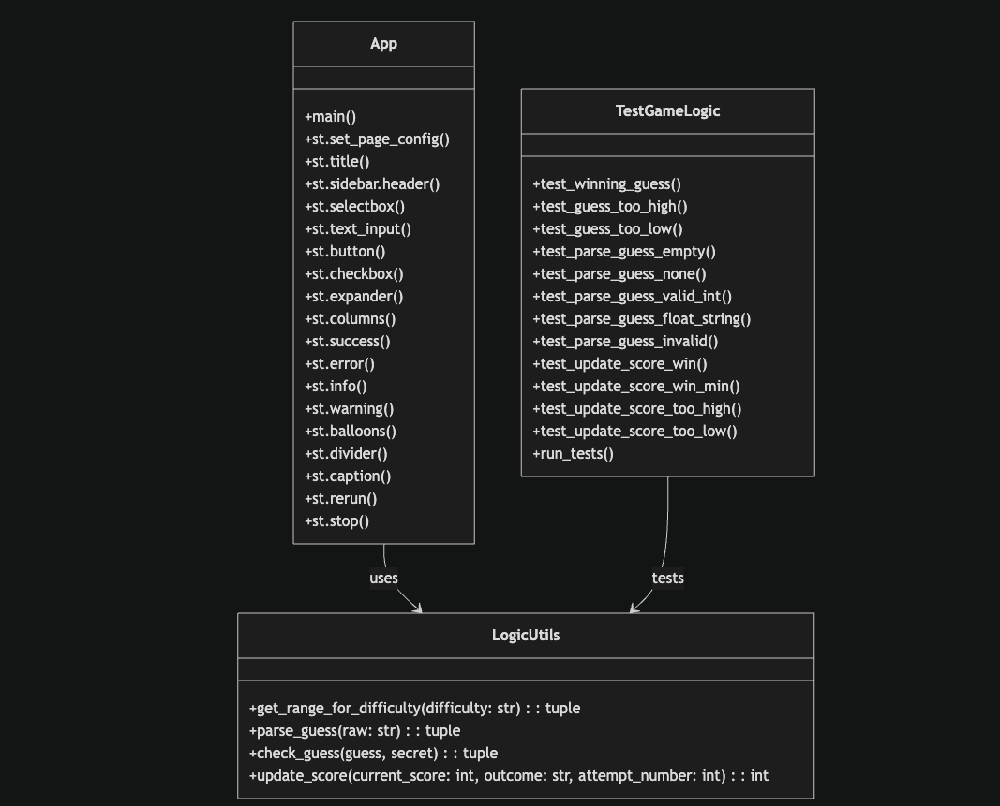

Data Flow Description:

Input: User enters a guess in the Streamlit UI.

Agent Controller: The central hub receives the input and coordinates with the logic_utils.py.

Process (Validation & Test): The Logic Engine calculates the outcome.

The Evaluator Agent runs a "shadow test" (comparing the result against test_game_logic.py criteria).

Guardrail: If the Evaluator detects a mismatch (e.g., the "Hint" logic is reversed), it logs the error and triggers a notification.

Output: The UI updates with the verified outcome and score.

classDiagram
    class App {
        +main()
        +st.set_page_config()
        +st.title()
        +st.sidebar.header()
        +st.selectbox()
        +st.text_input()
        +st.button()
        +st.checkbox()
        +st.expander()
        +st.columns()
        +st.success()
        +st.error()
        +st.info()
        +st.warning()
        +st.balloons()
        +st.divider()
        +st.caption()
        +st.rerun()
        +st.stop()
    }
    
    class LogicUtils {
        +get_range_for_difficulty(difficulty: str): tuple
        +parse_guess(raw: str): tuple
        +check_guess(guess, secret): tuple
        +update_score(current_score: int, outcome: str, attempt_number: int): int
    }
    
    class TestGameLogic {
        +test_winning_guess()
        +test_guess_too_high()
        +test_guess_too_low()
        +test_parse_guess_empty()
        +test_parse_guess_none()
        +test_parse_guess_valid_int()
        +test_parse_guess_float_string()
        +test_parse_guess_invalid()
        +test_update_score_win()
        +test_update_score_win_min()
        +test_update_score_too_high()
        +test_update_score_too_low()
        +run_tests()
    }
    
    App --> LogicUtils : uses
    TestGameLogic --> LogicUtils : tests

